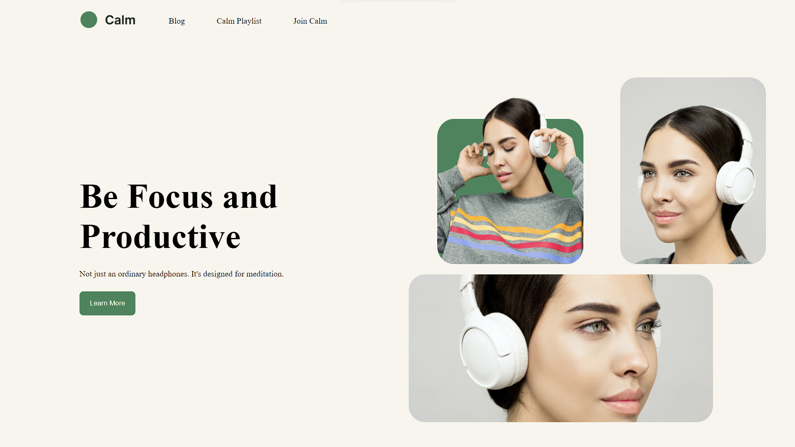

# Project 1 - Calm

[![LinkedIn][linkedin-shield]][linkedin-url]
[![Hashnode][hashnode-shield]][hashnode-url]

## Output
 

 

## Live Project
[Live Project URL](https://jaymalde.github.io/Full-Stack-JavaScript-Bootcamp-2.0/CSS-Assignments/Project-1-Calm/index.html)
 

[linkedin-shield]: https://img.shields.io/badge/-LinkedIn-black.svg?style=for-the-badge&logo=linkedin&colorB=0B5FBB
[linkedin-url]: https://www.linkedin.com/in/jaymalde/

<!-- Hashnode -->

[hashnode-shield]: https://img.shields.io/badge/Hashnode-2962FF?style=for-the-badge&logo=hashnode&logoColor=white
[hashnode-url]: https:///jaymalde.hashnode.dev/